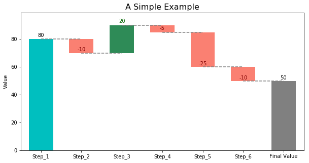
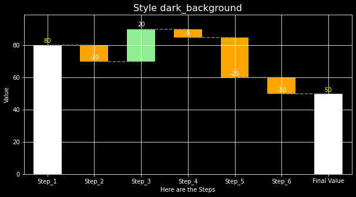

# Waterfall Chart in Python
---

The waterfall_ax library creates flexible waterfall charts based on matplotlib. 

## Installation

```
pip install waterfall-ax
```

## Get Started

To create a waterfall chart, simply provide the cumulative values you'd like to plot. The intermediate deltas will be calculated in the backend.

Sample code:

```
from waterfall_ax import WaterfallChart
import matplotlib.pyplot as plt

# Cumulative values
step_values = [80, 70, 90, 85, 60, 50]

# Plot
waterfall = WaterfallChart(step_values)
wf_ax = waterfall.plot_waterfall(title='A Simple Example')
plt.show()
```



## Be Flexible 
waterfall_ax makes it very flexible to create and edit the waterfall charts. Here are some examples.

1. **Style Control**. You have control over the bar style, line style and labels. Please refer to [waterfall_ax.py](waterfall_ax/waterfall_ax.py) for details. 
    
    In short, 
    * For the bar and line elements you can pass any kwargs that matplotlib accepts for these two styles
    * For labels, you can set step_names, metric_name, last_step_label, and bar_labels. 
    
    Here is an example:
    
    ```
    # Labels
    metric_name = 'Balance'
    step_names = ['Balance0', 'Spend_clothes', 'Salary', 'Spend_grocery', 'Spend_phone', 'Spend_parking']
    last_step_label = 'End Balance'
    
    # Styles
    bar_labels = [x for x in range(7)]
    bar_kwargs = {'edgecolor': 'black'}
    line_kwargs = {'color': 'red'}

    # Plot waterfall
    waterfall = WaterfallChart(
        step_values, 
        step_names=step_names, 
        metric_name=metric_name, 
        last_step_label=last_step_label
    )
    wf_ax = waterfall.plot_waterfall(
        title='Change Styles and Labels',
        bar_labels = bar_labels,
        bar_kwargs = bar_kwargs,
        line_kwargs = line_kwargs
    )
    plt.show()
    ```
    


2. **Color Control**. You can change colors for:
    * Bar color for positive deltas
    * Bar color for negative deltas
    * Bar color for the very first bar
    * Bar color for the last bar
    * Label text color for positive deltas
    * Label text color for negative deltas
    * Label text color for the very first bar
    * Label text color for the last bar
    
    As a result, the waterfall charts can work very well for a variety of styles. An example:

    ```
    # Set style
    plt.style.use('dark_background')

    # Plot
    waterfall = WaterfallChart(step_values)
    color_kwargs = {
        'c_bar_pos': 'lightgreen',
        'c_bar_neg': 'orange',
        'c_bar_start': 'white',
        'c_bar_end': 'white',
        'c_text_pos': 'white',    
        'c_text_neg': 'white',
        'c_text_start': 'yellow',
        'c_text_end': 'yellow'
    }
    wf_ax = waterfall.plot_waterfall(title='Style dark_background', color_kwargs=color_kwargs)
    plt.show()
    ```
    


3. **Continue Editing**. The plot_waterfall() function returns an Axes object and can also take in an . So it’s very flexible to use the object outside the class for further editing. An example by following the previous style:
    ```
    # Add grid and xlabel after the waterfall ax is created
    wf_ax = waterfall.plot_waterfall(title='Style dark_background', color_kwargs=color_kwargs)
    plt.grid(True)
    plt.xlabel('Here are the Steps')
    plt.show()
    ```
    


4. **As a subplot**. The plot_waterfall() function can also take an exising Axes, so that it's easy to make the waterfall chart a subplot. An example:
    ```
    # Set style
    plt.style.use('ggplot')

    # Create subplots
    fig, axs = plt.subplots(1, 2, figsize=(15, 4))
    ax1, ax2 = axs
    ax1.plot(range(10))
    ax1.set_title('First subplot')

    # Plot waterfall
    waterfall = WaterfallChart(step_values)
    wf_ax = waterfall.plot_waterfall(ax=ax2, title='Waterfall as a subplot')
    plt.show()
    ```
    
    
    
